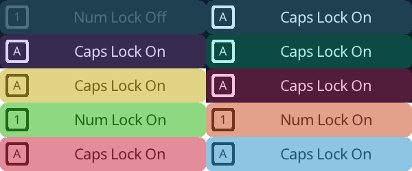
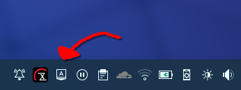
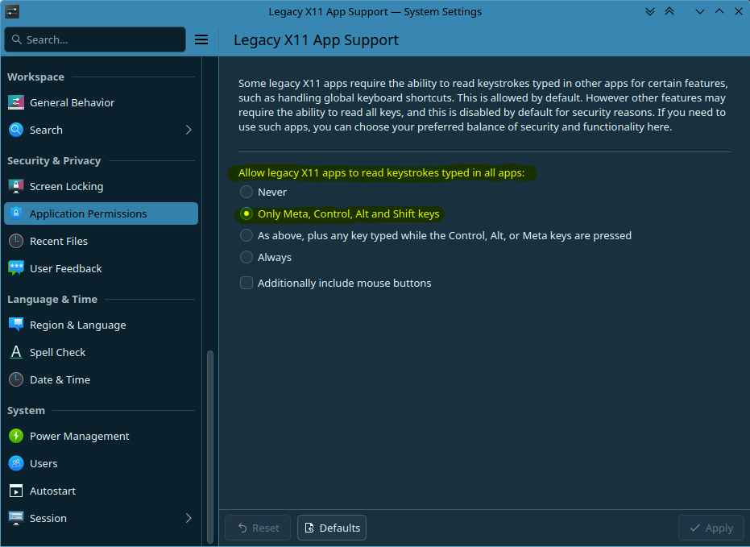

# Linux Keyboard OSD Notifier

> A basic OSD notification and tray indicator that notifies capslock and numlock states

## Features

- System consistent design (for KDE)
- Supports theming via system preferences
- Works with user-space permissions
- A tray indicator that shows active states of modifier keys

## Why?

Some keyboards have no light for indicating capslock and numlock states *(like mine)*. And there's no way to understand the active state until press the key. And most OEMs won't provide some mini-tools like that for Linux. So I made a OSD Notifier for Linux.

## Working Mechanism

The application is hooking modifier keys via X11 to handle state changes (since Wayland doesn't provide a way without requiring root permissions). And using a Wayland window to show OSD.

## FAQ

- I am using X11 and the application is not working.
    > The application is using Wayland APIs to show OSD window. So application is not supported on your platform.

- I am using Wayland however OSD doesn't shown.
    > Please ensure your system is supporting XWayland and ensure a composer setting is not blocking listening modifier key events to prevent data leaks.

    > If you are using KDE, you can change the behavior via `System Settings > Security & Privacy > Application Permission > Legacy X11 App Support`.
    >
    > 

- The Wayland window is stealing focus/keeping on bottom when I press modifier key, how can I prevent that?
    > If you're using KDE, you can import [the window rule](./src/osd.kwinrule) to fix that. Since Wayland doesn't provide a way to set them, you should use a window rule or accept it as is.

## License

This project is licensed by [Mozilla Public License 2.0](./LICENSE)